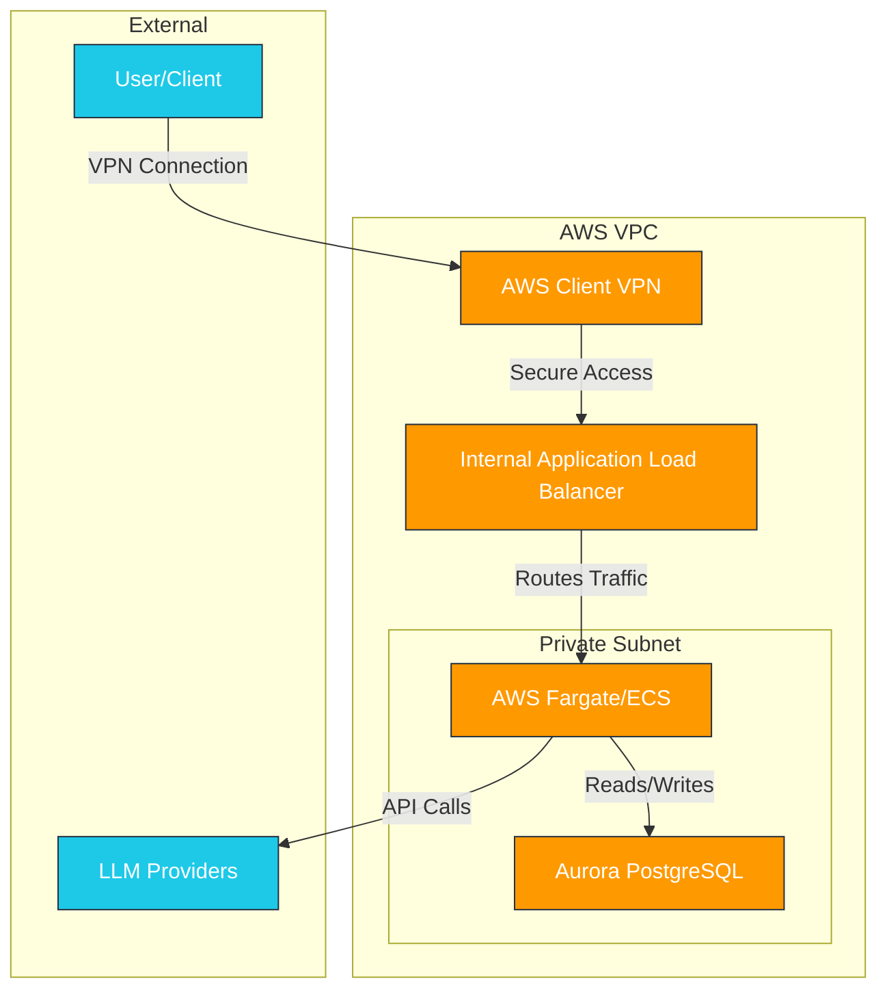
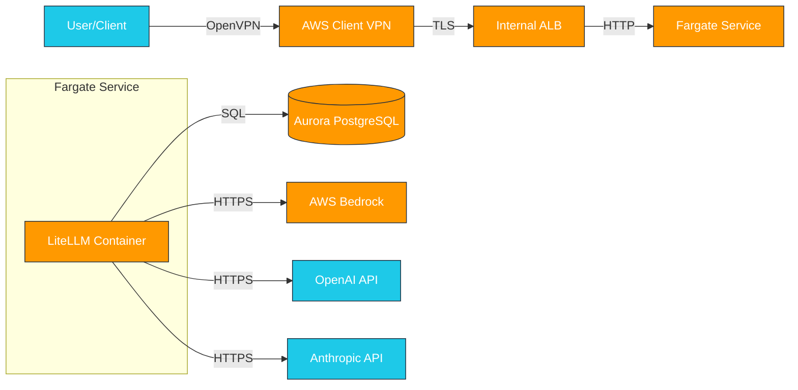
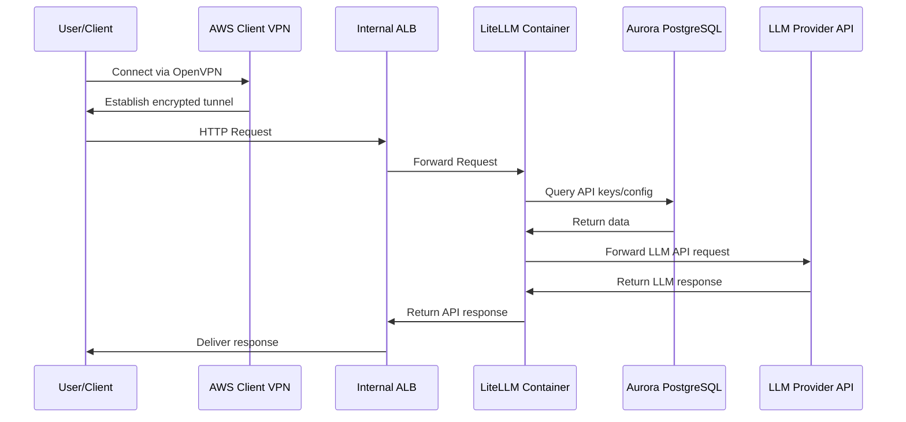

# LiteLLM AWS Architecture Diagrams

## High-Level Architecture Diagram



## Component Diagram



## Network Flow Diagram



## Deployment Architecture

```mermaid
graph TD
    subgraph "AWS Cloud"
        subgraph "VPC"
            subgraph "Availability Zone 1"
                subgraph "Private Subnet 1"
                    Fargate1[Fargate Task]
                    DB1[Aurora Instance]
                end
            end
            
            subgraph "Availability Zone 2"
                subgraph "Private Subnet 2"
                    Fargate2[Fargate Task]
                    DB2[Aurora Instance]
                end
            end
            
            ALB[Internal ALB]
            VPN[Client VPN Endpoint]
            
            ALB --> Fargate1
            ALB --> Fargate2
            Fargate1 --> DB1
            Fargate2 --> DB2
            DB1 <--> DB2
        end
    end
    
    User[User/Client] --> VPN
    VPN --> ALB
    
    classDef az fill:#FF9900,stroke:#232F3E,color:white;
    classDef subnet fill:#7AA116,stroke:#232F3E,color:white;
    classDef resource fill:#1EC9E8,stroke:#232F3E,color:white;
    
    class "Availability Zone 1","Availability Zone 2" az;
    class "Private Subnet 1","Private Subnet 2" subnet;
    class Fargate1,Fargate2,DB1,DB2,ALB,VPN resource;
```

Note: These diagrams are in Mermaid format and can be rendered as images using Mermaid.js or other Mermaid rendering tools. For the README.md, you'll need to create actual PNG/SVG images from these diagrams.
